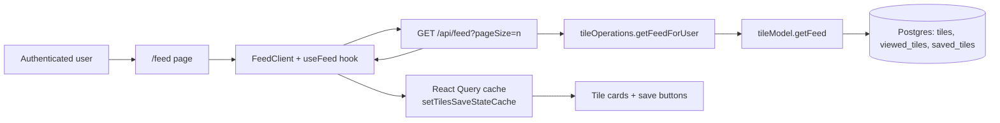
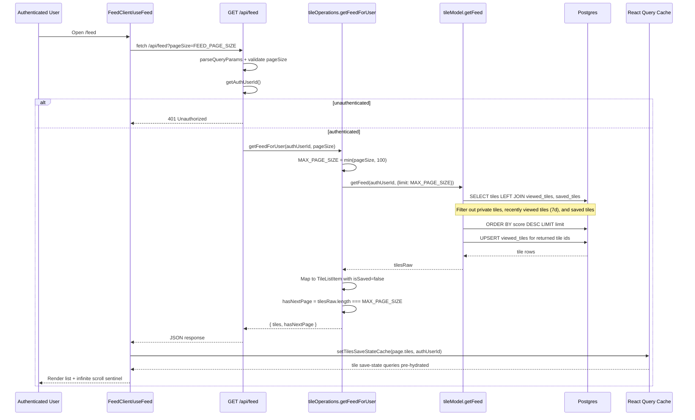

[ReadMe](/README.md)

# Wedding Ready Feed Fetch Architecture

This document focuses on how the personalized tile feed is fetched, filtered, and cached for logged-in users.

## 1) System Context (high-level)

## 2) Detailed Request/Query Flow

## 3) Why Save State Is Set During Feed Fetch

- `getFeedForUser` sets `isSaved: false` for each feed tile because the SQL query already excludes saved tiles for that user.
- `useFeed` then calls `setTilesSaveStateCache(...)` to pre-populate per-tile save-state query entries, preventing extra per-tile requests when save buttons render.
- Result: fewer network round trips and consistent save-button state across components.

## 4) Query/Ranking Behavior Worth Noting

- Feed candidates are sorted by `tiles.score` descending.
- The feed query excludes:
  - private tiles,
  - tiles viewed by the user in the last 7 days,
  - tiles already saved by the user.
- Returned tiles are immediately marked viewed (upsert) within the same DB transaction to avoid instant repeats.

## 5) Key Files

- `src/app/feed/feed-client.tsx`
- `src/app/_hooks/use-feed.ts`
- `src/app/api/feed/route.ts`
- `src/operations/tile-operations.ts`
- `src/models/tile.ts`
- `src/utils/usequery-helpers.ts`
