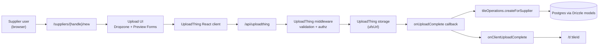
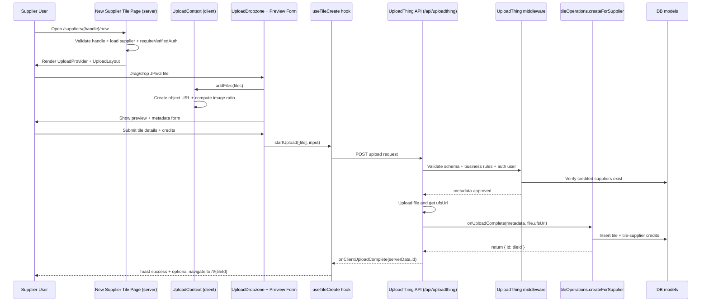

[ReadMe](/README.md)

# Wedding Ready Upload Architecture

This document focuses on how supplier image uploads work end-to-end in Wedding Ready.

## 1) System Context (high-level)

## 2) Supplier Upload Flow (detailed)

## 3) Key Components and Responsibilities

- **Route guard and ownership checks**: `src/app/suppliers/[handle]/new/page.tsx`
  - Validates handle, loads supplier, checks authenticated user is part of supplier team.
- **Client upload state**: `src/app/suppliers/[handle]/new/upload-context.tsx`
  - Tracks selected files, preview URLs, and computed image ratios.
- **Dropzone and constraints**: `src/app/suppliers/[handle]/new/upload-dropzone.tsx`
  - Accepts JPEG images and enforces max size from UploadThing config.
- **Upload orchestration on client**: `src/app/_hooks/use-tile-create.ts`
  - Triggers upload, updates progress/status, handles success/error toasts.
- **UploadThing server contract**: `src/app/api/uploadthing/core.ts`
  - Input parsing, business-rule validation, auth checks, and post-upload tile creation.
- **Tile business write path**: `src/operations/tile-operations.ts`
  - Persists tile + credit links through data models.

## 4) Data Written During Upload

1. File is stored by UploadThing and exposed as `file.ufsUrl`.
2. New row in `tiles` table with:
   - image URL (`imagePath`),
   - image ratio,
   - text metadata,
   - creator user ID,
   - location,
   - public visibility.
3. New rows in `tile_suppliers` (credits), one per credit entry.

## 5) Important Guardrails

- **AuthN/AuthZ at page and upload middleware**
  - Server page blocks non-supplier users from the upload screen.
  - Middleware re-checks auth user identity before accepting upload metadata.
- **Schema validation**
  - Upload input must match `tileUploadSchema`.
- **Business-rule validation**
  - Current rule in middleware enforces supplier ID consistency in credits.
- **Client UX safety**
  - Before-unload warning is enabled while there are pending files in context.

## 6) Notes for Future Improvements

- Add explicit transaction/rollback semantics around tile + credits creation.
- Add observability spans for middleware validation vs onUploadComplete write path.
- Consider background image processing pipeline (thumbnails/webp variants).
