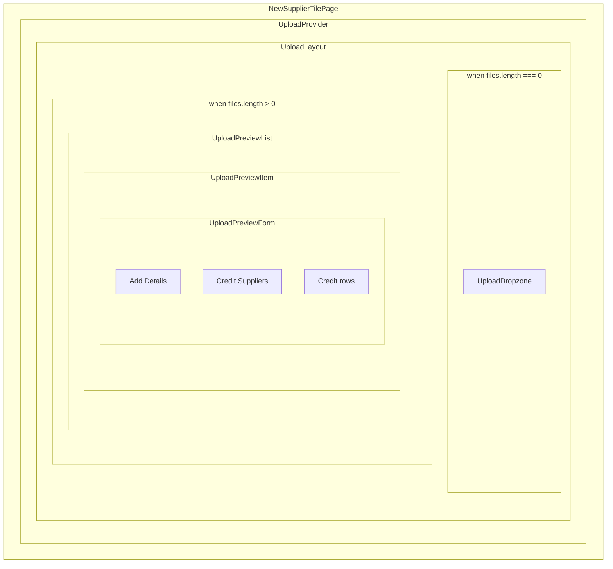

# Upload Tile Flow: Client-Side Deep Dive

This document describes the **multi-step tile upload refactor** on the Creator Upload page: the move from a one-step upload to a flow where users can add up to several images, configure each with basic details and supplier credits in two steps, and upload per tile—all with client-only state and no draft persistence. It is intended both as internal reference and as a portfolio piece that illustrates problem framing, architecture and separation of concerns, and implementation choices.

[Upload Architecture](upload-architecture.md) covers the server side (UploadThing, middleware, database). This deep dive focuses on the **client UX and refactor story**.

---

## Problem and goal

**Problem:** Wedding Ready needs fresh pins that link to the right local suppliers. Pins only stay useful if they are credited correctly. The product also needs to support batch uploading (e.g. multiple images at a time).

The original upload was one-step and did not support proper supplier crediting or a multi-step UX.

**Goal:** Let users upload multiple images (e.g. up to 10) and fully configure each tile (basic info + supplier credits) with minimal friction and good performance.

---

## Users and scope

**Users:** Logged-in suppliers/creators using the Creator Upload page at `/suppliers/[handle]/new`.

**In scope:**

- Multi-step form per image (basic info then credits).
- Add/remove supplier credits per image.
- Per-image upload and delete.
- Client-side only; safe to lose state on refresh.

**Out of scope (explicitly):**

- Draft persistence across refresh.
- Bulk “upload all” button.
- Drag-and-drop reordering.

**Constraints:**

- Max 10 images (currently enforced in marketing copy; not yet enforced in dropzone code).
- Client-only state.
- Avoid making typing in one form slow due to re-renders.

---

## Architecture overview

### Component hierarchy



Layout renders either the dropzone or the preview list, not both. PreviewList contains one UploadPreviewItem per file (one shown).

**Data flow (short):** The upload context holds the list of files (`UploadItem[]`). Each item has a stable `uploadId` used as the React key. Form state and step (1 or 2) live inside each card’s `UploadPreviewForm`. The upload mutation is scoped per card via `useTileCreate({ uploadId })`. Submitting a card sends that file and its form data to UploadThing; on success, the hook removes the item from context and shows a toast.

---

## Architecture and separation of concerns (ownership)

A core design goal was **clear ownership**: each layer owns a narrow set of responsibilities and does not own the rest. That keeps re-renders predictable, state easy to reason about, and components testable.

### UploadProvider / context

**Owns:**

- The list of files (`UploadItem[]`).
- Object URL lifecycle (create in `addFiles`, revoke on remove and on unmount).
- `addFiles`, `removeFile`, `clearFiles`.
- `supplier` and `authUserId` (needed by children for payload and defaults).

**Does not own:** Form state, step state, upload mutation, or any UI (dropzone, list, cards).

**Rationale:** Single source of truth for “what’s in the batch.” File list changes are low frequency (add/remove/clear). Consumers stay decoupled from each other.

### UploadLayout

**Owns:**

- The decision: show dropzone when `files.length === 0`, otherwise show preview list.
- The `beforeunload` guard when there are pending files.

**Does not own:** The file list or any form/mutation state.

**Rationale:** One place for “empty vs editing” and “warn before leave” UX.

### UploadDropzone

**Owns:**

- Translating user drop/select into `addFiles(files)`.
- Client-side file type and size checks (e.g. JPEG, max size from route config).

**Does not own:** The file list, form state, or any upload logic.

**Rationale:** Thin adapter between the drag-drop surface and the context.

### UploadPreviewList

**Owns:**

- Mapping `files` to a list of `UploadPreviewItem` with `key={file.uploadId}`.
- Wrapping each item in an `ErrorBoundary`.

**Does not own:** Form state or upload mutation; it is a presentational list.

**Rationale:** List re-renders only when `files` changes. Each child owns its own state.

### UploadPreviewItem

**Owns:**

- The **lifecycle** of one tile: thumbnail, upload mutation (`useTileCreate`), building the payload (`TileUpload`), and wiring submit/delete to context (`removeFile`) and form (`onSubmit` / `onDelete`).
- Choosing what to show: thumbnail + form when status is idle; status + progress when uploading.

**Does not own:** Form field state or step state—those live in `UploadPreviewForm`.

**Rationale:** One component bridges “this file” and “upload this tile.” Mutation and success/error stay scoped to this card so one card’s upload does not affect others.

### UploadPreviewForm

**Owns:**

- All form state (React Hook Form).
- Step (1 vs 2) and the validation gate before moving to step 2 (e.g. `trigger(['location'])`).
- Credit array via `useFieldArray` (append/remove rows).

**Does not own:** The file, the upload mutation, or when to remove the item from the list. It receives `onSubmit` and `onDelete` as props; the parent decides what those do (e.g. call `startUpload` and then `removeFile` on success).

**Rationale:** Form is reusable and testable; parent owns the “meaning” of submit and delete.

### Credit rows / SupplierSearchInput

**Owns:**

- Per row: search UI state and RHF bindings for that credit index (supplier, service, serviceDescription).
- Each `SupplierSearchInput` instance has its own `useSupplierSearch` state (search term, debounced query); cache is shared when search terms match.

**Does not own:** The file list or the upload.

**Rationale:** Typing in one row does not affect others; re-renders stay local to that row/card.

### Action → owner (quick reference)

| Action | Owned by |
|--------|----------|
| Add files to the batch | UploadProvider (`addFiles`) |
| Remove file from list | UploadProvider (`removeFile`) |
| Show dropzone vs list | UploadLayout |
| Warn before leaving with unsaved files | UploadLayout (`beforeunload`) |
| Validate file type/size and call addFiles | UploadDropzone |
| Start upload for this card | UploadPreviewItem via `useTileCreate` |
| Build payload (formData, imageRatio, authUserId, supplierId) | UploadPreviewItem |
| Remove card on successful upload | useTileCreate (calls `removeFile(uploadId)`) |
| Form fields, step, validation, credits array | UploadPreviewForm |
| Add/remove credit row | UploadPreviewForm (`useFieldArray`) |
| Supplier search and selection per row | Credit row / SupplierSearchInput |

---

## Core mental model

### UploadItem

One “upload item” in memory is:

```ts
type UploadItem = {
  uploadId: string   // stable key for React + hook identity
  file: File
  fileObjectUrl: string
  ratio: number      // width/height, computed once in addFiles
}
```

**Critical:** `uploadId` is set once when the file is added (e.g. `crypto.randomUUID()`) and never changes while the item is in the list. That keeps React’s reconciliation and hook state (including `useTileCreate` and RHF) attached to the correct instance when the parent re-renders.

### Where state lives

- **Global (context):** File list only. Churn is low (add/remove/clear).
- **Per card:** Form state (RHF), step (1 or 2), and upload mutation state (status, progress). Re-renders are limited to that card.
- **Per credit row:** Search term and that row’s field bindings. Typing in one row does not force other rows or other cards to re-render.

---

## Implementation deep dive (by layer)

### Context ([upload-context.tsx](src/app/suppliers/[handle]/new/upload-context.tsx))

- **addFiles:** Accepts `File[]`, returns `Promise<void>`. For each file it creates an `uploadId`, object URL, and **ratio** (width/height) via `getImageRatio(file)` (async, using a temporary Image load). Then appends the new `UploadItem`s to state. Ratio is stored so the client can send it with the upload metadata; the server persists it for layout.
- **removeFile(uploadId):** Removes the item and revokes its object URL.
- **clearFiles:** Revokes all object URLs and sets the list to empty.
- **Unmount cleanup:** A `useEffect` with an empty dependency array revokes all current object URLs on unmount so no URLs leak.
- **supplier / authUserId:** Passed into the provider from the server page so that the form can default the first credit to the tile creator and the submit path can build `TileUpload` without prop-drilling through multiple layers.

### Layout and dropzone ([upload-layout.tsx](src/app/suppliers/[handle]/new/upload-layout.tsx), [upload-dropzone.tsx](src/app/suppliers/[handle]/new/upload-dropzone.tsx))

- Layout renders either `UploadDropzone` or `UploadPreviewList` based on `files.length`. When `files.length > 0`, it registers `beforeunload` so the browser warns on refresh/close.
- Dropzone uses `useDropzone` (from UploadThing helpers). It validates file type and size (e.g. against route config or `MAX_UPLOAD_FILE_SIZE`), then calls `addFiles(acceptedFiles)`. There is no explicit “max 10 files” check in code today; marketing copy says “up to 10.”

### Per-card: UploadPreviewItem and useTileCreate ([upload-preview.tsx](src/app/suppliers/[handle]/new/upload-preview.tsx), [use-tile-create.ts](src/app/_hooks/use-tile-create.ts))

- **UploadPreviewItem** receives one `UploadItem`. It calls `useTileCreate({ uploadId: file.uploadId })` so the mutation is keyed by that card. It passes `onSubmit` and `onDelete` into `UploadPreviewForm`. On submit, it builds `TileUpload`: `{ formData, imageRatio: file.ratio, authUserId, supplierId }` and calls `startUpload([file.file], input)`. On delete, it calls `removeFile(file.uploadId)`.
- **useTileCreate** holds status (e.g. IDLE, CREATING, UPLOADING, COMPLETE, ERROR) and upload progress. It uses `useUploadThing('tileUploader', { … })` with `onClientUploadComplete`: on success it calls `removeFile(options.uploadId)` and shows a toast with “View tile” linking to `/t/:tileId`. So “upload succeeded” is owned by the hook; “remove from list” is the hook’s responsibility via context.
- Each card is wrapped in an `ErrorBoundary` so one failing card does not take down the whole list.

### Form: UploadPreviewForm ([upload-preview-form.tsx](src/app/suppliers/[handle]/new/upload-preview-form.tsx))

- Two steps: “Add Details” (title, location, description) and “Credit Suppliers.” Step is local state; only the fields for the current step are rendered.
- React Hook Form with `zodResolver(tileUploadFormSchema)`, `mode: 'onBlur'`. Default values: first credit row is the current `supplier.id` and first service; that row is non-removable and displayed as “Tile creator” with `@supplier.handle`.
- Moving from step 1 to step 2 is gated by `form.trigger(['location'])`. A focus effect sets focus appropriately when the step changes (e.g. title on step 1, first credit service on step 2).
- Credits are managed with `useFieldArray` under `name="credits"`. Each row has `key={field.id}`. Rows can be appended (generic default: supplierId '', service VENUE, serviceDescription '') and removed (first row disabled). Remove button focuses “Add Credit” after a timeout so keyboard users have a sensible focus target.

### Credits and supplier search ([upload-preview-form.tsx](src/app/suppliers/[handle]/new/upload-preview-form.tsx), [supplier-search-input.tsx](src/components/tiles/supplier-search-input.tsx))

- Credit schema (in [validation-schema.ts](src/app/_types/validation-schema.ts)): `{ supplierId, service, serviceDescription }`. Location is required on the form; credits array must pass the credit schema.
- `SupplierSearchInput` uses `useSupplierSearch()`: debounced query keyed by search term (e.g. `queryKeys.supplierSearch(debouncedSearchQuery)`). Each input instance has its own hook state, so search is per-row; when two rows type the same term, they share the same query cache. The spec mentioned keying by `uploadId` and index; the implementation keys only by search term for simplicity and cache reuse.

---

## Performance and re-render strategy

- **Stable keys:** `uploadId` for each card, `field.id` from `useFieldArray` for each credit row. React (and RHF) keep component and hook identity stable across parent re-renders.
- **What triggers re-renders:**
  - **File list change (add/remove/clear):** Context updates; `UploadLayout` and `UploadPreviewList` re-render. Each `UploadPreviewItem` is re-run but keeps its internal state thanks to the stable key. This is low frequency.
  - **Upload mutation state (status, progress):** Only the card that owns that `useTileCreate` instance re-renders.
  - **Form/field updates:** RHF re-renders the components that subscribe to the changed fields; other cards and other rows are unaffected.
- **High-frequency actions** (typing in title, description, or supplier search) are local to one card or one row. List-level re-renders only happen on add/remove/clear.

---

## Server integration (short)

- The client sends one file and metadata in a single UploadThing request. The route is `tileUploader` with `maxFileCount: 1` per request. Metadata matches `tileUploadSchema` (formData, imageRatio, authUserId, supplierId).
- Middleware validates schema, auth, and that all credited suppliers exist; then the file is uploaded. `onUploadComplete` calls `tileOperations.createForSupplier` with the file URL and metadata; the response includes the new tile id for the “View tile” toast.

For the full server flow and diagrams, see [Upload Architecture](upload-architecture.md).

---

## Spec vs implementation

**Matches the original spec:**

- Multi-step form per image (basic info then credits).
- Per-card upload and delete.
- Credits as an array; add/remove rows.
- Stable `uploadId` for keys and hook identity.
- RHF + useFieldArray; object URL lifecycle (create/revoke).
- Upload mutation scoped per card via `uploadId`.

**Deviations:**

- **Ratio:** Computed in context inside `addFiles` (async), not in the dropzone handler. Keeps dropzone thin and centralizes “what we store per file” in the context.
- **Credits shape:** Implementation uses `service` and `serviceDescription` (and supplierId); spec used “contribution.” Product choice to align with the rest of the app.
- **First credit:** Locked to the tile creator (current supplier), non-removable, displayed as “Tile creator.” Improves UX and consistency.
- **Client-side resize:** Not implemented; only image ratio is computed. Resize could be added in `addFiles` or in the drop handler later.
- **Supplier search query key:** Keyed by search term only (and app-level query keys), not by `uploadId`/index. Simpler and allows cache sharing across rows.
- **Max 10 files:** Not enforced in the dropzone; marketing says “up to 10.” Can be added (e.g. reject or trim in `addFiles` or dropzone).
- **ErrorBoundary and beforeunload:** Added in implementation; not in the original spec. Improve resilience and leave-without-lose UX.
- **Naming:** e.g. `UploadPreviewForm` instead of “UploadWizardForm”; `UploadPreviewItem` instead of a generic “card” name. Same roles.

---

## Success criteria

From the original PR:

- [x] A user can upload multiple images.
- [x] A user can fully configure and upload a single tile (basic info + credits).
- [x] Credit multiple suppliers without obvious lag (state and re-renders are scoped per card/row).
- [x] No obvious regressions to the existing upload flow (same server route and business rules).

**Caveat:** Max 10 images is not enforced in code; only mentioned in product copy.

---

## Future improvements

- **Draft persistence:** Persist file list and form state (e.g. to sessionStorage or a draft API) so refresh does not lose work.
- **Bulk “upload all”:** Single action to submit all configured cards in sequence or parallel (with clear progress and error handling).
- **Drag-and-drop reorder:** Reorder cards before upload (would require stable ordering in context).
- **Enforce max 10:** Reject or trim in dropzone or `addFiles` when `files.length` would exceed 10.
- **Client-side resize:** Optionally resize/compress images before `addFiles` to reduce upload size.
- **React.memo on credit row:** If profiling shows unnecessary re-renders when other rows change, wrap the row (or SupplierSearchInput) in `React.memo`.

---

## References

**Key files:**

- [src/app/suppliers/[handle]/new/page.tsx](src/app/suppliers/[handle]/new/page.tsx) – Server page, auth, UploadProvider + UploadLayout.
- [src/app/suppliers/[handle]/new/upload-context.tsx](src/app/suppliers/[handle]/new/upload-context.tsx) – UploadItem type, context, addFiles/removeFile/clearFiles, getImageRatio.
- [src/app/suppliers/[handle]/new/upload-layout.tsx](src/app/suppliers/[handle]/new/upload-layout.tsx) – Dropzone vs list, beforeunload.
- [src/app/suppliers/[handle]/new/upload-dropzone.tsx](src/app/suppliers/[handle]/new/upload-dropzone.tsx) – useDropzone, file checks, addFiles.
- [src/app/suppliers/[handle]/new/upload-preview.tsx](src/app/suppliers/[handle]/new/upload-preview.tsx) – UploadPreviewList, UploadPreviewItem, ErrorBoundary.
- [src/app/suppliers/[handle]/new/upload-preview-form.tsx](src/app/suppliers/[handle]/new/upload-preview-form.tsx) – UploadPreviewForm, steps, useFieldArray, CreditFieldArray.
- [src/app/_hooks/use-tile-create.ts](src/app/_hooks/use-tile-create.ts) – useTileCreate, status, progress, startUpload, removeFile on success.
- [src/app/_hooks/use-supplier-search.ts](src/app/_hooks/use-supplier-search.ts) – useSupplierSearch (debounced search).
- [src/components/tiles/supplier-search-input.tsx](src/components/tiles/supplier-search-input.tsx) – SupplierSearchInput.
- [src/app/api/uploadthing/core.ts](src/app/api/uploadthing/core.ts) – tileUploader route, middleware, onUploadComplete.
- [src/app/_types/validation-schema.ts](src/app/_types/validation-schema.ts) – tileUploadFormSchema, creditSchema, TileUpload, TileUploadForm.

**Related docs:**

- [Upload Architecture](upload-architecture.md) – Server-side flow: UploadThing, middleware, tile creation, guardrails.
